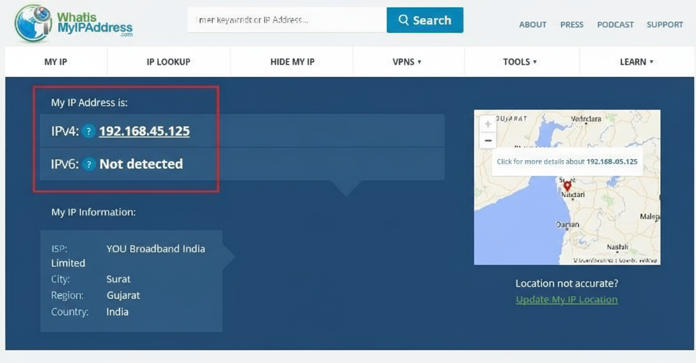
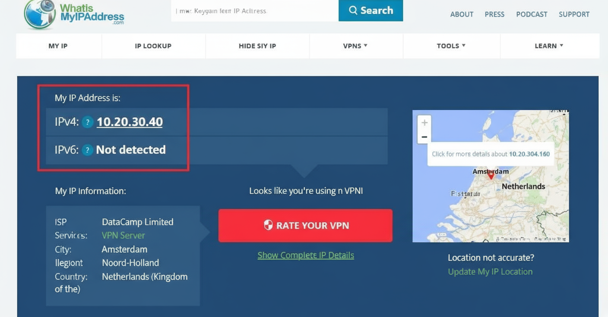

VPN Connection 

## Objective
**Understand the role of VPNs in protecting privacy and secure communication.**

## Tools
- Free VPN client (ProtonVPN free tier, Windscribe free)
- Browser
- [WhatIsMyIPAddress.com](https://www.whatismyipaddress.com/)

## Deliverables
A report describing VPN setup steps and connection status with screenshots.

---

## Hints/Mini Guide (Expanded)

### 1. Choose a Reputable Free VPN Service and Sign Up
- Evaluate available free VPN services based on reputation, features, and privacy policy.
- Recommended: **ProtonVPN (Free), Windscribe Free**
- Go to the provider’s website and register for a free account using a unique email.

### 2. Download and Install the VPN Client
- Download the correct VPN client for your operating system (Windows, Mac, Linux).
- Open the installer, follow the prompts, and finish the installation.
- Log in to the app using credentials from step 1.

### 3. Connect to a VPN Server
- From within the VPN client, view the list of available servers.
- Choose a server closest to your current (real) location for optimal speed, or any server worldwide.
- Click "Connect" and make sure the client shows an active connection status.

### 4. Verify Your IP Address Has Changed
- Open [WhatIsMyIPAddress.com](https://www.whatismyipaddress.com/) before connecting to the VPN—note your public IP address.
- Take a screenshot for documentation.

  

- Connect to the VPN and refresh the site—your IP should now reflect the VPN server’s location.
- Take another screenshot for your report.

  

### 5. Browse a Website to Confirm Traffic is Encrypted
- Open a new tab and browse to a secure site (HTTPS).
- If you can access the web as normal, your traffic is being sent through the VPN tunnel.
- Optionally, look for a VPN indicator or padlock symbol in your browser status bar.

### 6. Disconnect VPN and Compare Browsing Speed and IP
- Disconnect in the VPN client.
- Go back to [WhatIsMyIPAddress.com](https://www.whatismyipaddress.com/) and ensure your IP reverts to the original.
- Browse websites and compare any changes in page speed or availability.
- Record observations: did browsing speed improve or decrease? Did some sites become accessible or blocked?

### 7. Research VPN Encryption and Privacy Features
- Go to your VPN provider’s website/help section.
- Note down the encryption protocols they use (examples: OpenVPN, WireGuard, IKEv2).
- Read the privacy policy or FAQ—confirm if they keep logs, how they handle user data, and under what jurisdictions they operate.
- Record these details for your report.

### 8. Write a Summary on VPN Benefits and Limitations
- List advantages: improved privacy/anonymity, encrypted traffic, access to region-locked content.
- Note drawbacks: possible reduced speed, trust in VPN provider, access restrictions by some sites, usability issues...

---

## Sample Summary

> VPNs are crucial privacy tools that hide real IP addresses and encrypt personal internet traffic. They offer a way to improve security when using unsecured networks and to bypass some geographic restrictions. However, free VPNs may have bandwidth limits, may show ads, or log activity—they are only as trustworthy as their privacy policies. Performance may decrease, and some websites block traffic from popular VPNs.

---

## Outcome

Gain hands-on experience with VPN software, understand real-world privacy implications, and learn to document and evaluate privacy-enhancing tools using practical methods and screenshots.
